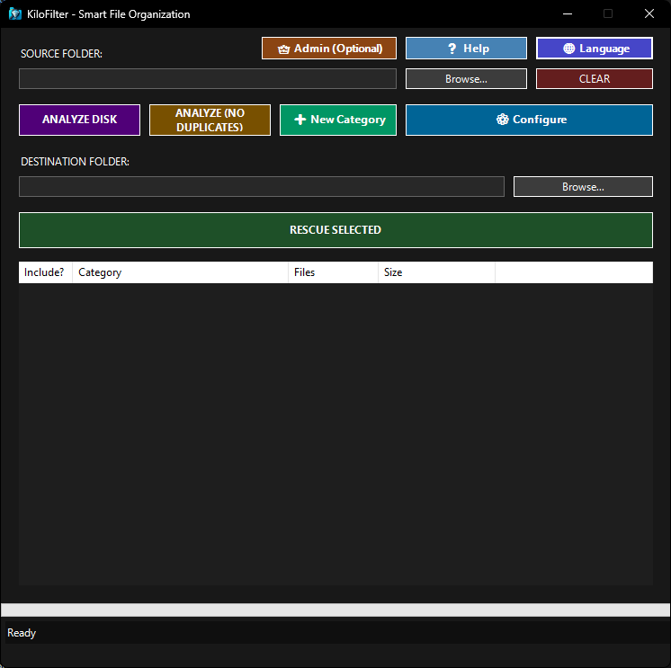

# KiloFilter

A modern utility to organize, analyze duplicates, and rescue files by type, with custom categories, duplicate detection, and multilingual support.



## 📸 Features Overview

KiloFilter is a powerful file management tool that helps you:
- 📂 Organize messy folders by file type automatically
- 🔍 Detect and report duplicate files using cryptographic hashing
- 📋 Create custom file categories and organize files accordingly
- 🎯 Rescue (copy) organized files to a new destination
- ⚙️ Fine-tune with blacklisting and minimum file size filters

## ✨ Key Features

| Feature | Description |
|---------|-------------|
| ❌ Smart duplicate deletion | Three strategies: Keep Newest, Keep Oldest, or Keep Smallest files |
| 📋 Real-time preview | See exactly which files will be deleted before confirming changes |
| 🔍 Advanced filtering | Search duplicates by filename and filter by size range (min/max) |
| 📂 Auto classification | Scans folders and sorts files by type (images, videos, docs, etc.) |
| 🔍 Duplicate detection | Finds identical files using partial and full file hashing (Blake3) |
| 📋 Detailed analysis | View file breakdowns by extension with statistics |
| 🏷️ Custom categories | Create your own file groups and add/manage extensions |
| 🚫 Blacklist | Exclude file types from analysis and rescue |
| 📏 Min file size | Ignore small/temporary files by setting size limits per extension |
| 🌐 Multilingual UI | Switch between English, Spanish, French, German, Italian, Japanese |
| 🗃️ Safe copy | Files are copied to organized folders, originals remain untouched |
| ⏹️ Cancel operations | Interrupt long-running scans and exports at any time |
| 🖱️ Drag & drop | Drag folders directly to source/destination fields |
| 💾 Report reopening | View previous duplicate analysis results instantly |

## 🪴 Recent Updates

### Smart Duplicate Deletion (v2.1.0 - Latest!)
- **Three deletion strategies**: Keep Newest, Keep Oldest, or Keep Smallest files
- **Real-time preview**: See exactly which files will be deleted before confirming
- **Advanced filtering**: Search duplicates by filename and filter by size range
- **Automatic preview**: Real-time updates as you change filters and strategies
- **Space calculation**: Shows total disk space that will be freed before deletion
- **Button emojis**: 22+ buttons with consistent emoji icons for better usability

### Hierarchical File Organization by Extension (v2.1.0 - New!)
- **Two-level folder structure**: Files organized by Category → Extension
- **Automatic extension detection**: System extracts file extension (JPG, PNG, PDF, etc.)
- **Smart subfolder creation**: Each file type gets its own subfolder
- **Example structure**:
  ```
  RESCATE_20260211_1430/
  ├── 📁 Imágenes/
  │   ├── 📁 JPG/
  │   ├── 📁 PNG/
  │   └── 📁 GIF/
  ├── 📁 Documentos/
  │   ├── 📁 PDF/
  │   └── 📁 XLSX/
  └── 📁 Videos/
      ├── 📁 MP4/
      ├── 📁 AVI/
      └── 📁 MKV/
  ```
- **Improved discoverability**: Find files by both category and exact type
- **Unknown extension handling**: Files without extensions placed in "UNKNOWN" folder

### Smart Cache System
- **Automatic caching**: Analysis results are automatically saved after each scan
- **Change detection**: Advanced content hashing detects if folder contents have changed
- **Instant reload**: Load previous analyses in <1 second instead of minutes—perfect for repeated scans
- **History browser**: New 📋 History button to browse, load, and manage all cached analyses
- **Auto cleanup**: Cache automatically removed after 30 days to prevent disk space accumulation
- **Transparent operation**: No configuration needed—cache works automatically in the background

### Duplicate Analysis & Management
- **Three-stage duplicate detection**: File size grouping → Partial hash (64KB) → Full file hash
- **Detailed reports**: View all duplicates with file paths, sizes, and wasted space
- **Selective deletion**: Choose which duplicates to delete while preserving originals
- **Instant reopening**: Reopen previous analysis results without rescanning

### Enhanced User Experience
- **Cancellable operations**: Click Cancel (⏹️) to stop analysis, duplicate scanning, or file rescue at any time
- **Drag & drop support**: Drop folders directly into source/destination fields
- **Progress tracking**: Real-time progress bars during file scanning and processing
- **Better organization**: Improved button layout and visual feedback

## ⚡ Performance: Smart Cache System

The Smart Cache System significantly speeds up your workflow when analyzing the same folders repeatedly:

**How it works:**
1. **First analysis**: Scans the folder completely and saves results to cache
2. **Subsequent analysis**: Detects if folder content has changed using cryptographic hashing
3. **No changes?**: Instantly load previous results from cache (typically <1 second)
4. **Changes detected?**: Automatically offers to perform a fresh scan or load cached results anyway

**Get the most out of it:**
- Click the **📋 History** button to see all cached analyses
- Select a previous analysis to reload it instantly
- Manually delete individual cache entries or clear all cache as needed
- Perfect for large folder hierarchies that have repeated analyses

**Cache management:**
- Caches are stored in `%AppData%\Roaming\KiloFilter\Cache` (user-accessible for inspection)
- Old caches (>30 days) are automatically removed on application startup
- All cache data is stored as human-readable JSON files

## 🧠 How It Works


### File Organization
1. Scans the source folder recursively
2. Groups files by extension and custom categories
3. Filters by blacklist and minimum file size settings
4. Organizes output in hierarchical structure:
   - **Primary level**: By category (Images, Videos, Documents, etc.)
   - **Secondary level**: By file extension (JPG, PNG, PDF, etc.)
5. Displays results in an interactive list with statistics

### Duplicate Detection
1. **Stage 1**: Groups files by identical file size
2. **Stage 2**: Hashes first 64KB of each file (fast comparison)
3. **Stage 3**: Calculates full file hash (Blake3) for exact matches
4. **Reports**: Shows duplicate groups with total wasted space
5. **Optional deletion**: Safely remove duplicates while keeping originals

## 📥 Installation

• Portable app: No installation required. Download or build and run `KiloFilter.exe`.
• Requirement: [.NET 8 Runtime](https://dotnet.microsoft.com/download/dotnet/8.0) (Windows).

Build from source:

```sh
git clone https://github.com/AIMDICK/KiloFilter.git
cd KiloFilter
dotnet publish -c Release -r win-x64 --self-contained false -o publish
```
The executable will be at `publish\KiloFilter.exe`.

## 🚀 How to Use

### Basic File Organization
1. **Source Folder** — Select the folder with your files (or drag & drop)
2. **Analyze Disk** — Scan and auto-classify files by type
3. **Review** — Check categories and file statistics
4. **Configure** — Adjust categories, blacklist, and minimum file sizes (optional)
5. **Destination Folder** — Choose where organized files will be copied
6. **Rescue** — Copy selected files to organized folders by category

### Smart Duplicate Deletion (v2.1.0+)
1. **Analyze Duplicates** — Scan for identical files using cryptographic hashing
2. **(Optional) Apply Filters**:
   - Enter filename search criteria (e.g., ".log" for log files only)
   - Set minimum/maximum file size range
   - Click **Apply Filters** to see preview
3. **Select Deletion Strategy**:
   - **Keep Newest** — Retains most recently modified file from each group
   - **Keep Oldest** — Retains original/oldest file from each group
   - **Keep Smallest** — Retains smallest file (optimizes storage)
4. **Review Preview** — See files marked for deletion and total space to be freed
5. **❌ Smart Delete** — Execute deletion (files are removed, not moved to trash)
6. **Confirm** — Verify the deletion in the confirmation dialog

### Advanced Duplicate Analysis (v2.0+)
1. **Analyze Duplicates** — Scan folder completely for identical files
2. **Review Report** — See duplicate groups, file counts, and wasted space
3. **Select Duplicates** — Choose which files to delete (originals are safe)
4. **Delete** — Remove duplicates and free up disk space

**Tip:** Use the **Cancel (⏹️)** button at any time to interrupt long-running operations.

## ⚠️ Disclaimer

Use at your own risk. The author is not responsible for any data loss. Always verify destination paths and keep backups of important files.

## 🛠 Tech Stack

- **Language**: C# 12
- **Framework**: .NET 8 (Windows Forms)
- **Hashing**: Blake3 (cryptographic file fingerprinting)
- **Concurrency**: Parallel.ForEach for multithreaded scanning
- **UI**: Windows Forms with custom dark theme
- **Localization**: 6 languages (English, Spanish, French, German, Italian, Japanese)

## 📄 License

This project is licensed under the MIT License. See the LICENSE file for details.

## Author

- AIMDICK ([GitHub](https://github.com/AIMDICK))
